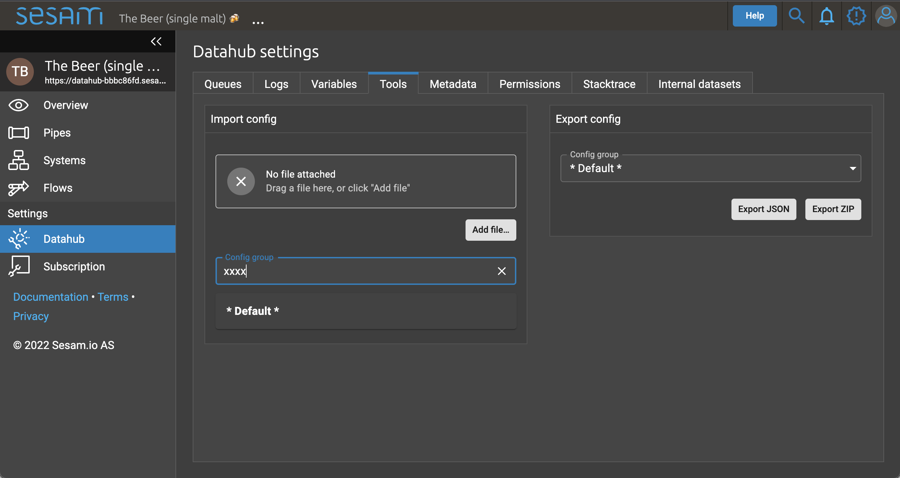

# template-generator
a small script for creating node folders with template dataflows that can be uploaded as a .zip file in Management Studio

Remember to specify config group if generating one or more of these in the node folder

